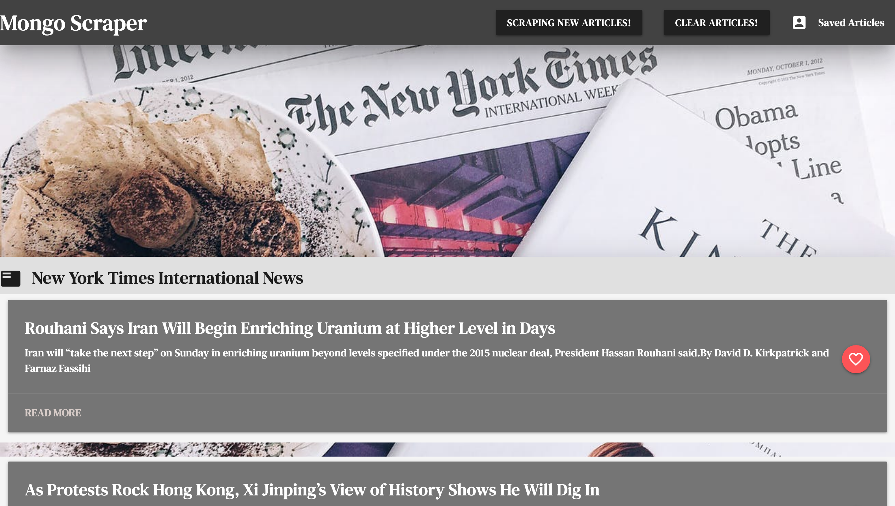

# Mongo-Scraper

It is my **MongoDB and Mongoose** Assignment in Gatech Coding bootcamp.

This is a web app that let users to view the latest international news from **New York Times** website, and they can also save articles they like and leave comments.

#### The demo of my `Mongo Scraper` application can be found [here](https://nyt-mongo-scraper2019.herokuapp.com/).

## Technologies used:
  * Node.js
  * MongoDB
  * Mongoose
  * Javascript
  * jQuery
  * AJAX/JSON
  * NPM modules:
    1. cheerio
    2. express
    3. express-handlebars
    4. mongoose
    5. axios
  * Material Design
  * CSS
  * HTML5

 #### One thing I can't finish: In Materialize, to open a modal, I need to type 
       $(document).ready(function(){
         $('.modal').modal();
       });
#### Then it just became quite difficult for me to show added notes to a saved article. I've asked TA Adam and Meguel and my online tutor about this issue, but none of them know how to solve it. As a result, I stopped here.

